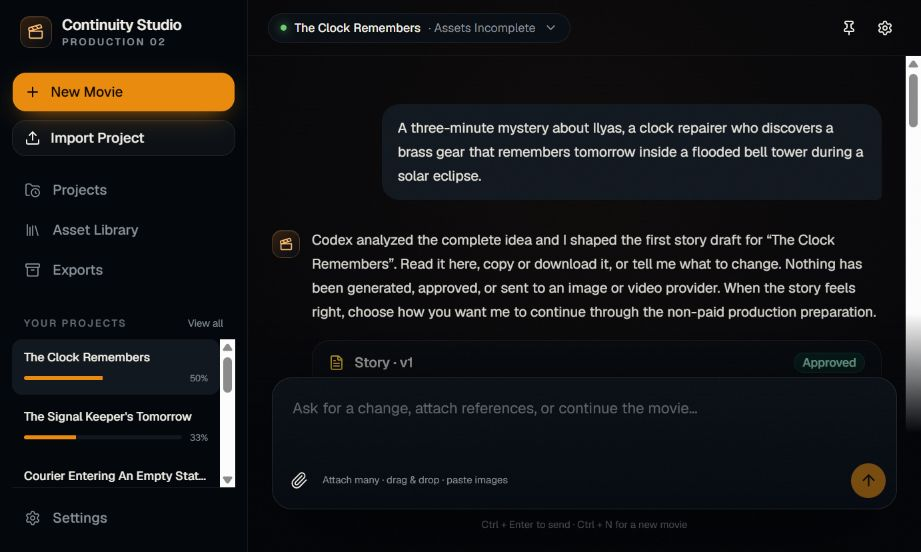
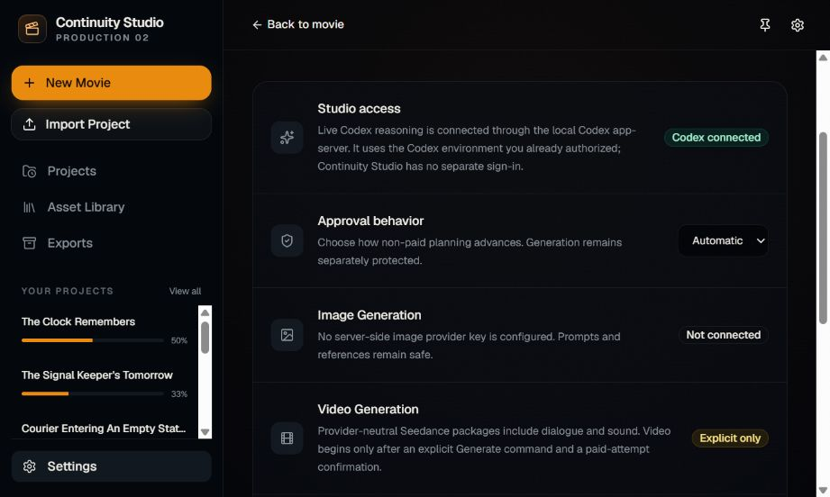
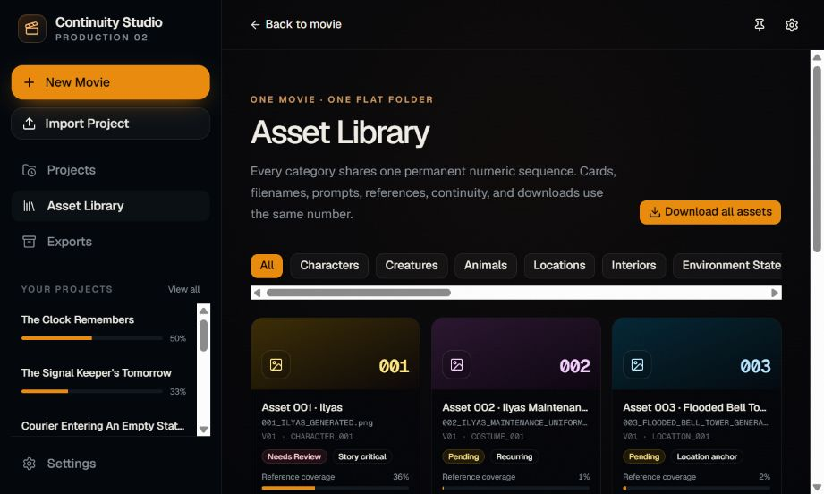
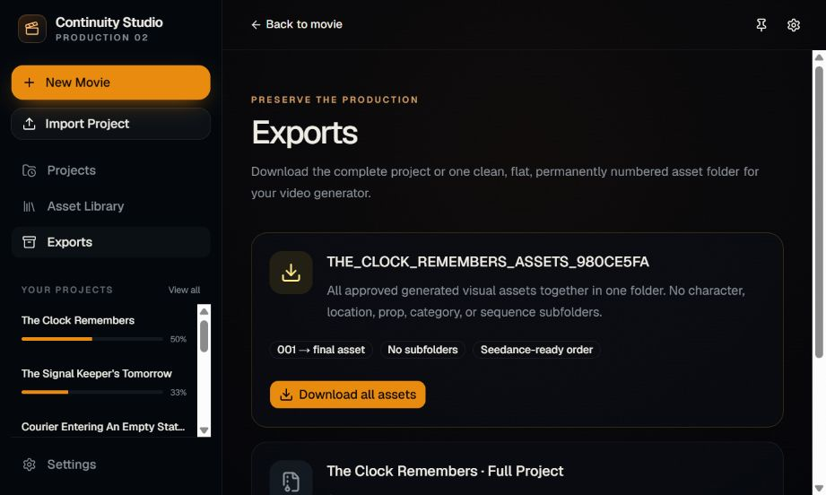

# Continuity Studio 2

[](https://github.com/momorzq-oss/continuity-studio-2/actions/workflows/ci.yml)
[](LICENSE)
[](https://nodejs.org/)

Continuity Studio 2 is a chat-first, project-based filmmaking production system. It turns a movie idea into a persistent production workspace covering story development, World and Film Bibles, complete asset discovery, permanent numbered references, scenarios, scripts, dialogue ownership, sequence planning, Seedance-ready prompts, continuity, recovery, and export.



## What makes it different

- **Codex is the local reasoning brain.** The Studio connects to the Codex desktop/CLI environment already authorized on your computer. There is no separate Continuity Studio sign-in.
- **One movie, one asset folder.** Every approved generated visual asset uses one permanent project-wide number and exports into one flat folder with no subfolders.
- **Continuity is production state.** Dialogue, costumes, references, opening states, ending states, immutable generation snapshots, and sequence dependencies remain bound to the project.
- **Generation is explicit.** Planning never starts image or video generation automatically. Seedance handles spoken dialogue and sound inside the generated video; the Studio does not create a separate audio asset pipeline.
- **The database is the source of truth.** Structured state, revision checks, recovery records, and immutable versions protect long-running productions.

## Screenshots

| Local Codex connection | Flat numbered asset library |
| --- | --- |
|  |  |

| Flat asset and project exports |
| --- |
|  |

## Quick start

### Requirements

- Node.js 22.13 or newer
- npm
- Codex desktop or the Codex CLI, already signed in

The [official Codex CLI guide](https://learn.chatgpt.com/docs/codex/cli) explains installation and the first ChatGPT sign-in. Continuity Studio reuses that local authorization; it does not show another OpenAI login inside the application.

### Install and run

```bash
git clone https://github.com/momorzq-oss/continuity-studio-2.git
cd continuity-studio-2
npm install
npm run dev
```

Open [http://localhost:3000](http://localhost:3000). In **Settings**, the Studio should show **Codex connected**.

`npm run dev` starts both parts of the local application:

- the Continuity Studio web interface on `localhost:3000`;
- a loopback-only Codex bridge on `127.0.0.1:4317`.

If Codex is temporarily unavailable, the Studio remains usable and labels the deterministic fallback honestly.

## Optional GPT Image generation

The Studio can turn prepared production-sheet briefs into real image assets with GPT Image. Copy the example environment file and add a server-side key:

```bash
cp .dev.vars.example .dev.vars
```

On PowerShell:

```powershell
Copy-Item .dev.vars.example .dev.vars
```

Then edit `.dev.vars`:

```dotenv
OPENAI_API_KEY=your-server-side-key
OPENAI_IMAGE_MODEL=gpt-image-2
```

The key is ignored by Git, remains server-side, and never enters browser state, project archives, or asset exports. Provider calls happen only after an explicit image-generation request.

## Commands

| Command | Purpose |
| --- | --- |
| `npm run dev` | Start the Studio and local Codex bridge |
| `npm run dev:web` | Start only the web app with fallback reasoning available |
| `npm run brain` | Start only the loopback Codex bridge |
| `npm run lint` | Run the source linter |
| `npm run typecheck` | Check TypeScript without emitting files |
| `npm run build` | Create the production build |
| `npm test` | Run API, persistence, workflow, and provider tests |
| `npm run test:ui` | Run the Chromium end-to-end test |
| `npm run test:all` | Run the complete automated test suite |

Install the Playwright browser once before running UI tests locally:

```bash
npx playwright install chromium
```

## Core production rules

- One movie uses one flat, globally numbered visual asset folder with no subfolders.
- Uploaded source references remain unnumbered; generated production sheets receive permanent asset numbers.
- One composite character, costume, environment, or prop sheet counts as one asset regardless of its internal panels.
- Regeneration retains the permanent asset number and filename position.
- Seedance handles generated dialogue and sound inside explicitly requested video.
- Story, asset, scenario, script, sequence, and prompt preparation never starts video automatically.
- Codex supplies schema-constrained creative reasoning and natural-language interpretation; it never writes project state directly.
- The production engine validates every mutation before the database commits it.

## Documentation

- [Complete filmmaker tutorial](docs/TUTORIAL.md)
- [Architecture and data flow](docs/ARCHITECTURE.md)
- [Authoritative production specification](specification/CONTINUITY_STUDIO_2.md)
- [Contributing guide](CONTRIBUTING.md)
- [Security policy](SECURITY.md)
- [Changelog](CHANGELOG.md)

## Hosted version

The current Sites build is available at [continuity-studio-2.momorabeeh.chatgpt.site](https://continuity-studio-2.momorabeeh.chatgpt.site). The local build is the intended setup when using the Codex desktop/CLI session as the Studio brain. The hosted version cannot reach a loopback Codex bridge on your computer.

## License

Continuity Studio 2 is available under the [MIT License](LICENSE).
